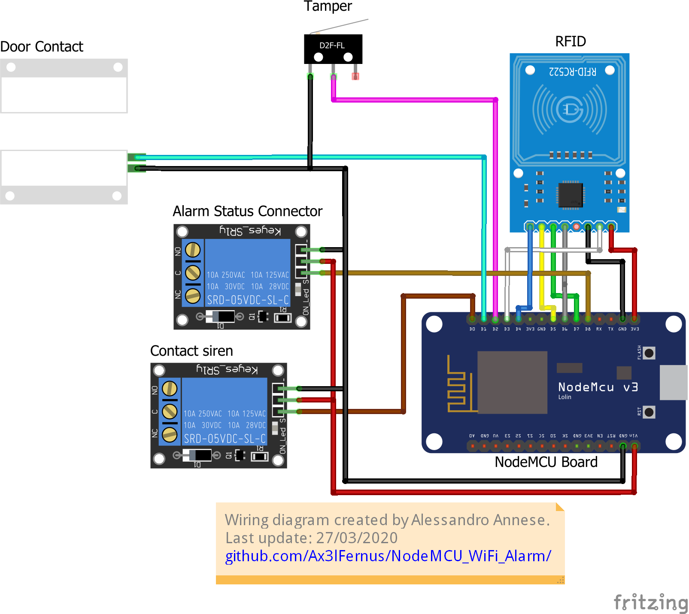

#  NodeMCU WiFi Alarm
A simple firmware that makes NodeMCU a Wireless alarm center.

  

## Table of Contents
- [Features](#features)
  - [RC522 Support](#rc522-support)
  - [Wireless Connectivity](#wireless-connectivity)
  - [APIs](#apis)
  - [Web Panel](#web-panel)
- [Installation](#installation)
  - [Wiring Diagram](#wiring-diagram)
  - [Flash firmware](#flash-firmware)
  - [Change the timers](#change-the-timers)
  - [Install Web Panel](#install-web-panel)
- [The Author](#the-author)
- [License](#license)

## Features
### RC522 Support
With the RFID-RC522 card it is possible to activate and deactivate the alarm via an RFID tag or card.
&nbsp;
### Wireless Connectivity
The NodeMCU card was born to have an integrated WiFi NIC. This functionality is used to check the card to read its status through the [APIs](#apis).
### APIs
The APIs provide commands to check and modify the alarm status. 
It is necessary to know the local IP of the card in order to interact with it through HTTP GET requests, the answers are in json format.
Here is the list of possible requests:
<ol>
<li>
To know the status of the card just send the request to http://CARD_IP/status. The answer is formatted as 

| Key | Type | Values | Description |
|---|---|---|---|
|door| String | `open` or `closed` | The value indicates whether the line of pin `D1` is open or closed. |
|h24 | String | `open` or `closed` | The value indicates whether the line of pin `D2` (tamper) is open or closed. |
|active| Bool| `true` or `false` | Indicates the alarm status: active (`true`) or inactive (`false`) |
|alarm | Bool| `true` or `false` | Indicates whether there is an alarm state. If `true`, the siren is in alarm. `false` otherwise. |
</li>
<li>
To activate the alarm just send the request to http://CARD_IP/1/on

| Key | Type | Values | Description |
|---|---|---|---|
|result| Bool | `true` or `false` | If `true`, the alarm is active. If `false`, the alarm is not active. |
|msg | String | - | A message written in natural language useful to describe the `result` key.  |
</li>
<li>
To deactivate the alarm just send the request to http://CARD_IP/1/off

| Key | Type | Values | Description |
|---|---|---|---|
|result| Bool | `true` or `false` | If `true`, the alarm is active. If `false`, the alarm is not active. |
|msg | String | - | A message written in natural language useful to describe the `result` key.  |
</li>
</ol>

### Web Panel

## Installation
### Wiring Diagram

The role of each pin used in the board is described below:
|Pin|Description|
| ------------ | ------------ |
|D0|It gives the signal to the siren to make it sound|
|D1|Detects the status of the door contact|
|D2|Detects the status of the tamper contact|
|D3|Reserved for the RST pin of the RFID board|
|D4|Reserved for the SDA pin of the RFID board|
|D5|Reserved for the SCK pin of the RFID board|
|D6|Reserved for the MISO pin of the RFID board|
|D7|Reserved for the MOSI pin of the RFID board|
|D8|Indicates the alarm status (enabled/disabled)|

### Flash firmware
You can flash the firmware on the NodeMCU via the [Arduino IDE](https://www.arduino.cc/en/Main/Software).
If you install the id for the first time you will need:
<ol>
<li>
Go to File -> Preferences -> add the link http://arduino.esp8266.com/stable/package_esp8266com_index.json in "Additional Boards Manager URLs" -> Click "OK"
</li>
<li>
Go to Tools -> Board -> click on "Boards Manager" -> search "esp8266" -> select leatest version -> click "Install" -> when finished click "Close"
</li>
<li>
Go to Tools and check this configurations:

| Name | Value |
|------|-------|
| Board| NodeMCU 1.0 (ESP-12E Module)|
|Upload Speed| 115200|
|Port|Select the COM port where the board is connected| 
</li> 
<li>
Download the <a href="https://github.com/miguelbalboa/rfid/releases/latest/">source code</a> of the RFID library -> open Arduino IDE and go to Sketch -> Include Library -> Add .ZIP Library... -> select the previously downloaded .zip file -> click Open.
</li>
<li>
Go to File -> Open -> select 'firmware.ino' file from the repository directory on your pc -> when the code opens go to "Network SSID" and "Network PASSWORD" in the code and insert your network credentials between the quotes

`// Network and UID Credentials` 
`const char *ssid = "<YOUR WIFI NAME HERE>";          //Network SSID` 

`const char *password = "<YOUR WIFI PASSWORD HERE>"; //Network PASSWORD` 

`const char *UID = "<UID CARD HERE>";                //UID Card Code` 
</li>
<li>
In "UID Card Code" enter the code of your card for enable/disable the alarm.
</li>
<li>
Click on the arrow pointing to the right to flash the card.
</li>
<li>
That's all!
</li>
</ol>

**:information_source: Note:** if you don't know the uid of your card you will need to: flash the card -> open the serial monitor (select the value 115200 as baud rate) -> scan the RFID card -> copy the UID that comes out in the monitor -> go to step 5.

### Change the timers
The alarm has times that can be changed at will:
- Exit time (from when the alarm is activated until the door is detected open)
- Entry time (from when the door is opened to the sound of the siren)
- Alarm time
- Tamper detection time (from when the alarm is deactivated until the open tamper is detected)

Times are expressed in milliseconds. Ex: for 10 seconds we will have to enter the value 10000. 

So `milliseconds = seconds * 1000`.

You can change the value of timers by finding the respective variables in the code:

`// Define siren sound time in case of alarm (in milliseconds, example: 10000ms = 10s)` 
`const long alarmTimeout = 180000;`

This line expresses the alarm time. To change it to 10 seconds just change the variable:

`const long alarmTimeout = 10000;`

This applies to all timers.

**:warning: Danger zone:** It isn't recommended to change the `timeoutTime` variable as it is reserved for the Web server.

### Install Web Panel
The web panel doesn't require installation so you can open `./webServer/index.html` with a browser without using additional programs. The only step is to open the `index.html` with a text editor (es. Notepad++) and insert the ip of the card in the local network in the field `nodemcu_ip`: 
`let nodemcu_ip = "<NODEMCU IP HERE>" //Set your NodeMCU IP ex: 192.168.1.1` 
However, you can upload the `index.html` to a web server to be able to visit it from other devices on the same local network.

**:warning: Warning:** the panel must be started on a device connected in the same local network as the NodeMCU board.
## The Author
This software was developed by Alessandro Annese. 
You can follow me on: 
[Linkedin](https://www.linkedin.com/in/alessandro-annese-79683913b/) 
[GitHub](https://github.com/Ax3lFernus)

## License
[BSD 3-Clause License](https://github.com/Ax3lFernus/NodeMCU_WiFi_Alarm/blob/master/LICENSE)

Copyright &copy; 2020, Alessandro Annese 
All rights reserved.
